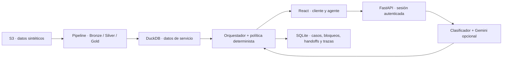

# LATAM Bank · Asistente de disputas con IA

**Factored AI & Data Hackathon 2026 · Equipo DAIA**

Asistente en español y portugués para recibir reclamos por cargos, identificar la transacción del cliente autenticado y registrar un caso o escalarlo a un agente con evidencia estructurada. Combina un clasificador de intención, Gemini y una política determinista: la IA interpreta y redacta; las herramientas verifican los datos y el código autoriza las acciones.

La entrega incluye el pipeline de datos, el modelo entrenado, la API, la interfaz de cliente y agente, y la evaluación end-to-end. Es un prototipo sobre **datos bancarios sintéticos**, con autenticación de prueba y sin conexión a un core bancario real.

## El problema y la evidencia

En el histórico procesado hay **24.491 disputas**, de las cuales el 20,2% incumple el SLA; la resolución media observada es de 15,5 días sobre 5.623 duraciones disponibles. Los contactos de Queja tienen un FCR de 43,6%. Estas métricas usan poblaciones distintas y sirven como contexto, no como comparación directa con el asistente.

La elección del problema y sus alternativas están en [la justificación con datos](docs/decisions_fase_0.md). Los numeradores, denominadores y supuestos están en [el reporte de datos e impacto](docs/eval_report_datos.md).

## Qué puede hacer

- Buscar cargos del cliente, mostrar candidatas y pedir que elija cuando hay ambigüedad.
- Recibir disputas por cargo no reconocido o cobro incorrecto, y consultar casos existentes.
- Solicitar confirmación antes de registrar un caso o bloquear una tarjeta; verificar el resultado después de actuar.
- Escalar por riesgo, datos insuficientes o fallas de herramientas con un handoff para el agente.
- Abstenerse ante solicitudes fuera de alcance y mantener trazas de decisiones, acciones y versiones.

No devuelve dinero ni adjudica una disputa. “Resolución automática” en la evaluación significa completar correctamente este flujo de intake sin intervención humana, no resolver el reclamo financiero.

## Material de entrega

- [Presentación](https://drive.google.com/file/d/1qL9YmYVax9IiLz2veBKN86D2ShNspujA/view?usp=sharing)
- [Video de demostración](https://drive.google.com/file/d/12uA1WvuzjHf72TgonPCdBEHeuM_t-Od_/view?usp=sharing)
- [Reporte final de evaluación](docs/eval_report.md)

## Probar la demo

Docker sirve la interfaz y la API en **http://localhost:8000**. Para desarrollo separado, la interfaz está en **http://localhost:5173** y la API en **http://localhost:8000**.

1. Seleccionar un escenario en la barra lateral. La interfaz inicia la sesión del cliente de prueba y envía su mensaje.
2. Revisar las transacciones propuestas y confirmar las acciones con los botones.
3. Abrir el panel de auditoría para ver la regla y las acciones verificadas; para un escalamiento, abrir la consola del agente y revisar el handoff.

| Escenario | Qué observar |
|---|---|
| Cargo normal | Identificación del cargo y registro del caso después de confirmar |
| Cargo ambiguo | Selección entre transacciones antes de continuar |
| Riesgo de fraude | Confirmaciones de bloqueo y caso, y escalamiento a fraude |
| Portugués | Búsqueda y respuesta en portugués |
| Solicitud fuera de alcance | Abstención con explicación del alcance |
| Intento de acceso ajeno | Sin exposición de transacciones de otro cliente |

El OTP de prueba es **`123456`**. La consola del agente usa **`AGT-DEMO` / `123456`**; son identidades simuladas. La API documentada está en `/docs` y `GET /api/health` informa las versiones y la fuente activa: debe indicar `gold:…` para usar la base incluida.

## Ejecutar

La demo incluye `data/gold/gold.duckdb` y el clasificador entrenado. **No necesita credenciales AWS ni regenerar el histórico.** Gemini es opcional: sin su llave, el sistema usa el clasificador, extracción por reglas y plantillas; sus resultados se reportan por separado.

### Docker

Requisito: Docker con Compose. Copiar `.env.example` a `.env` y configurar un `JWT_SECRET` propio de al menos 32 caracteres. Para habilitar Gemini, completar `GEMINI_API_KEY` y `GEMINI_MODEL` con un modelo disponible para la cuenta. El ID registrado en las corridas finales fue `gemini-3.8-flash`.

```bash
docker compose up --build
```

Abrir http://localhost:8000. `FAULT_INJECTION=false` debe mantenerse para la demo pública. La configuración de despliegue está en `render.yaml`; ver [operación y límites del alojamiento](docs/operations.md).

### Local · Windows / PowerShell

Requisitos: Python 3.12, Node.js 20 y npm. Desde la raíz del repositorio:

```powershell
py -3.12 -m venv .venv
.venv/Scripts/python.exe -m pip install -r requirements.txt
Copy-Item .env.example .env
# Configurar JWT_SECRET y, opcionalmente, Gemini en .env.
.venv/Scripts/python.exe -m uvicorn app.main:app --app-dir backend --reload --port 8000
```

En otra terminal:

```powershell
cd frontend
npm ci
npm run dev
```

En Linux/macOS, crear el entorno con `python3 -m venv .venv` y usar `.venv/bin/python`; el frontend se ejecuta igual. También están disponibles `make setup`, `make dev-backend` y `make dev-frontend`.

## Arquitectura



El pipeline normaliza fechas y monedas, deduplica y valida calidad antes de publicar. Gold minimiza los datos de servicio; el estado operativo vive en SQLite. Las consultas se restringen al cliente del JWT, las acciones requieren confirmación y la redacción de Gemini pasa por un verificador con fallback a plantillas. La política vigente es **1.3.0**, con fecha de referencia fija **2026-06-17** para los datos estáticos del reto.

## Resultados de evaluación

Held-out congelado de **189 conversaciones** (174 en alcance), con tres corridas por configuración. La métrica principal exige todos los campos correctos, ningún resultado prohibido y ningún handoff entre los casos en alcance.

| Configuración | Resolución automática segura | Escalamientos omitidos / 68 |
|---|---:|---:|
| B1 · palabras clave, reglas y plantillas | 36,2% | 17 |
| S · clasificador, reglas y plantillas | 45,4% | 13 |
| S · clasificador + Gemini | **48,5%** (47,7–49,4%) | **4** |

El techo de automatización de este set es 60,9%: los demás casos requieren escalamiento. Las tres repeticiones usan los mismos casos; el rango no es un intervalo de confianza.

**Limitaciones que acompañan los resultados:** S con Gemini tiene una alerta de confirmación ambigua por corrida y omite un escalamiento ante fraude por canal digital. Las dos alertas de B1 son falsos positivos revisados del grader. El set usa mensajes sintéticos o traducidos, no evalúa inglés y reutiliza algunas transacciones de demo. Hubo cambios del sistema después de la primera corrida del held-out: se declaran ambas versiones y no se presenta la final como una prueba nunca vista.

La proyección central de **477 horas de agente al año** es un escenario offline con supuestos de volumen y tiempo de atención, **no ahorro observado en producción**. El [reporte final](docs/eval_report.md) contiene costos, latencias, desagregaciones, alertas, supuestos y limitaciones.

## Verificación y reproducción

```powershell
.venv/Scripts/python.exe -m pytest -q
.venv/Scripts/python.exe -m eval.cases.validar_casos
# Nueva evaluación: Gemini requiere llave y puede generar costos.
.venv/Scripts/python.exe -m eval.runner --split heldout --system S B1 --llm both --runs 3 --stage final
```

Los [artefactos de las nueve corridas finales](docs/evidence/fase6_corridas_finales.zip) permiten inspeccionar y recalificar los resultados originales sin llamar a Gemini. Su contenido y el procedimiento están en [el Índice de documentación](docs/README.md).

Para reconstruir el histórico desde S3, configurar las credenciales del reto y ejecutar `python -m data_pipeline.run_pipeline --full`. No forma parte del arranque de la demo; las opciones incrementales, la calidad y la publicación están en [contratos de datos](docs/data_contracts.md). Las bases completas, caches y reportes de trabajo se generan localmente y no se incluyen en la entrega.

## Documentación

| Documento | Contenido |
|---|---|
| [Reporte final de evaluación](docs/eval_report.md) | Comparación con baselines, seguridad, costo, impacto y limitaciones |
| [Arquitectura y contratos](docs/design.md) | Alcance, política, herramientas, handoff, API y autenticación |
| [Datos y calidad](docs/data_contracts.md) | Pipeline, esquemas, minimización, linaje y reproducción |
| [Model card](ml/intent/model_card.md) | Selección del clasificador, fuentes, desempeño y limitaciones |
| [Evaluación de Gemini](ml/llm/report.md) | Extracción, redacción, verificación y fallback |
| [Operación](docs/operations.md) | Despliegue, trazas, recuperación y requisitos para producción |
| [Índice completo](docs/README.md) | Evidencia, figuras y anexos metodológicos |

## Aclaración de cuentas del equipo

Tres integrantes usan cuentas de GitHub cuyo correo asociado es distinto del correo con el que se inscribieron al hackatón. La correspondencia es la siguiente:

| Usuario de GitHub | Correo asociado a GitHub | Correo de inscripción |
|---|---|---|
| [CarpTaj](https://github.com/CarpTaj) | car22539@uvg.edu.gt | alina.carias@gmail.com |
| [Disotoo](https://github.com/Disotoo) | sot22737@uvg.edu.gt | dfsf2004@gmail.com |
| [ignaciomendeza](https://github.com/ignaciomendeza) | men22613@uvg.edu.gt | nanumendezalvarez03@gmail.com |
