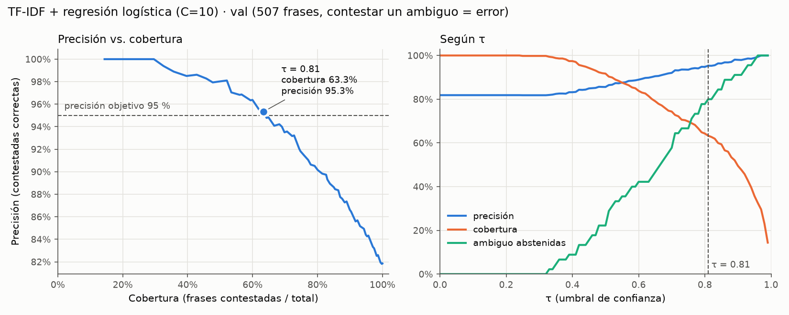

# Model card · clasificador de intención (Fase 4.2)

**Dueño:** B · **Fecha:** 29-sep-2026 · **Decisión:** D4.3 en `docs/decisions.md`
**Modelo servido:** `tfidf_lr-C10-20260930-18569ee2` (desde el 30-sep, con el lote de fuera de alcance de D4.6; antes `tfidf_lr-C10-20260929-17b293b7`) (`ml/intent/model/`, se regenera con `make train`)
**Umbral:** `tau_intencion: 0.81` en `config/policy.yaml` (introducido en política 1.2.0; vigente en 1.3.0)

## 1. Resumen

| | val | test |
| :-- | --: | --: |
| macro-F1 (5 clases, sin abstención) | 0,908 | **0,702** |
| F1 es · pt · mix | 0,929 · 0,878 · 0,919 | 0,698 · 0,673 · 0,693 |
| Cobertura con τ = 0,81 | 63,3 % | 35,5 % |
| Precisión con τ = 0,81 | 95,3 % | 84,5 % |
| Frases `ambiguo` abstenidas | 80,0 % | 79,2 % |

TF-IDF (palabras + n-gramas de caracteres) + regresión logística, C = 10. Gana en val según el criterio escrito antes de entrenar. En test cae 21 puntos: el test viene de otra fuente y otro autor, y no alcanza la precisión de 95 % que τ garantizaba en val.

## 2. Uso previsto

- **Qué hace:** recibe el mensaje del cliente (ES, PT o mezcla) y devuelve una de 5 intenciones (`cargo_no_reconocido`, `cobro_incorrecto`, `tarjeta_comprometida`, `estado_disputa`, `fuera_de_alcance`) con una confianza entre 0 y 1: la probabilidad de la clase más probable.
- **Dónde:** `backend/app/nlu/classifier.py`, detrás de `understand()`. Si la confianza es menor que τ, el sistema consulta una segunda opinión de Gemini cuando está habilitado (D4.5), antes de aplicar la ruta determinista de aclaración o búsqueda. La comparación del clasificador solo usa abstención bajo τ. Si el modelo no carga, el NLU cae al stub de palabras clave y lo registra.
- **Qué no hace:** no extrae monto, fecha ni comercio (Fase 4.3, Gemini). No decide acciones: la intención solo elige el camino del flujo determinista (D1.1), y las acciones pasan por las reglas de política y una confirmación explícita del cliente.
- **Fuera de uso:** mensajes en otros idiomas, conversaciones de varios turnos como una sola entrada y cualquier decisión que no pase por la política.

## 3. Datos

Resumen de `data_report.md` (D4.2). 2.748 frases en seis etiquetas (las 5 intenciones más `ambiguo`) y tres idiomas (`es` 50 %, `pt` 42 %, `mix` 8 %).

| Split | Frases | Fuente |
| :-- | --: | :-- |
| train | 2.041 | Banking77 traducido (1.397) + suplemento (644) |
| val | 507 | Banking77 traducido (352) + suplemento (155) |
| test | 200 | 50 familias generadas con ChatGPT y revisadas por el equipo |

- **Banking77:** Casanueva, I., Temčinas, T., Gerz, D., Henderson, M. y Vulić, I. (2020). *Efficient Intent Detection with Dual Sentence Encoders*. NLP4ConvAI (ACL 2020). arXiv:2003.04807. Licencia **CC-BY-4.0**. https://huggingface.co/datasets/PolyAI/banking77. Consultas reales de clientes de un banco en inglés: se filtraron, se tradujeron a ES o PT con Claude y se re-etiquetaron con `labeling_guide.md` (153 de 1.747 frases, el 8,8 %, cambiaron de etiqueta).
- **Suplemento:** 799 frases (160 familias) generadas con Claude y revisadas, para lo que Banking77 no tiene: `estado_disputa`, `ambiguo`, portuñol, jerga regional, casos límite e inyecciones.
- **Test:** otra fuente y otro autor que train/val. Similitud TF-IDF máxima con train/val: 0,648. Sin ruido artificial.
- **Split:** train/val 80/20 **por familia**, estratificado por fuente × etiqueta × idioma. Ruido de chat reproducible (`noise.py`) solo en train/val.
- **Ninguna frase se generó ni se tradujo con Gemini**, porque Gemini es candidato.
- **Entrenamiento:** el modelo se entrena sin las frases `ambiguo`. En evaluación, cada frase `ambiguo` cuenta como "debería abstenerse".

## 4. Criterio de selección

Escrito y subido **antes** de entrenar y de abrir el test: [`criterio_seleccion.md`, commit `51dbbe6`](https://github.com/ArielaMishaanCohen/factored-hackathon-2026-daia/commit/51dbbe6d3edfd9cc704b24e6d1435bb491cee22f) (29-sep-2026 16:57; el primer run de test es de las 19:09).

1. Gana el mejor **macro-F1 en val** (5 clases, sin `ambiguo`, sin abstención).
2. Si la diferencia con el siguiente es **< 2 puntos**, gana el más barato y rápido.
3. **τ** = el umbral con mayor cobertura que da **precisión ≥ 95 % en val** (contestar un `ambiguo` cuenta como error).
4. El test se abre una vez, con el modelo y τ ya fijados, y se reportan todos los candidatos.

Sesgo declarado desde el principio: val sale de la misma distribución que train, lo que favorece a los modelos entrenados frente a Gemini zero-shot.

## 5. Candidatos

| # | Candidato | Variantes probadas en val |
| :-: | :-- | :-- |
| 0 | Clase mayoritaria | – |
| 1 | Reglas por palabras clave ES/PT, escritas desde `labeling_guide.md` sin mirar val ni test | – |
| 2 | TF-IDF (palabras 1-2 + caracteres 2-5, `char_wb`) + regresión logística balanceada | C ∈ {0,1; 1; 10} |
| 3 | Embeddings multilingües (`fastembed`, ONNX) + regresión logística balanceada | MiniLM-L12 y multilingual-e5-small; C ∈ {0,1; 1; 10}; e5-small también con 6 clases (predecir `ambiguo` = abstenerse) |
| 4 | Gemini zero-shot, salida JSON (`gemini-3.8-flash`, `prompts/intent_zeroshot_v1.txt`, temperatura 0) | – |

**Candidatos saltados:** el 5 (clasificador de Banking77 ya entrenado, traduciendo al inglés) y el 6 (zero-shot NLI multilingüe) eran opcionales y **no se corrieron** por tiempo. Los dos necesitan PyTorch y no iban a entrar a la imagen del backend.

## 6. Resultados

Macro-F1 y F1 por idioma: sin `ambiguo` y sin abstención. Cobertura, precisión y `ambiguo` abstenidas: todas las frases, con el τ que cada candidato eligió en val. Tabla completa de val en `comparacion_candidatos.md`; de test, en `resultados_test.md`.

### Val (507 frases, 45 `ambiguo`): mejor variante de cada candidato

| Candidato | macro-F1 | F1 es | F1 pt | F1 mix | τ | Cobertura | Precisión | `ambiguo` abstenidas |
| :-- | --: | --: | --: | --: | --: | --: | --: | --: |
| Mayoritaria | 0,099 | 0,103 | 0,099 | 0,057 | 0,00 | 100,0 % | 29,8 % | 0,0 % |
| Reglas | 0,646 | 0,661 | 0,620 | 0,574 | 0,00 | 100,0 % | 58,8 % | 0,0 % |
| **TF-IDF + LR (C=10)** ★ | **0,908** | 0,929 | 0,878 | 0,919 | 0,81 | 63,3 % | 95,3 % | 80,0 % |
| Embeddings e5-small + LR (C=10, 5 clases) | 0,857 | 0,875 | 0,845 | 0,731 | 0,66 | 57,8 % | 95,6 % | 93,3 % |
| Embeddings e5-small + LR (C=10, 6 clases) | 0,856 | 0,871 | 0,845 | 0,768 | 0,61 | 58,6 % | 96,0 % | 100,0 % |
| Gemini zero-shot | 0,904 | 0,917 | 0,870 | 1,000 | 0,96 | 41,8 % | 97,6 % | 93,3 % |

### Test (200 frases, 24 `ambiguo`), abierto una sola vez

| Candidato | macro-F1 val | **macro-F1 test** | F1 es | F1 pt | F1 mix¹ | Cobertura | Precisión | `ambiguo` abstenidas | Latencia p50 | Costo por 1.000 |
| :-- | --: | --: | --: | --: | --: | --: | --: | --: | --: | --: |
| Mayoritaria | 0,099 | 0,055 | 0,062 | 0,057 | 0,000 | 100,0 % | 14,0 % | 0,0 % | 0,0 ms | USD 0 |
| Reglas | 0,646 | 0,538 | 0,598 | 0,423 | 0,518 | 100,0 % | 45,0 % | 0,0 % | 0,0 ms | USD 0 |
| **TF-IDF + LR (C=10)** ★ | 0,908 | **0,702** | 0,698 | 0,673 | 0,693 | 35,5 % | 84,5 % | 79,2 % | 0,6 ms | USD 0 |
| Embeddings (5 clases) | 0,857 | 0,706 | 0,662 | 0,713 | 0,689 | 47,5 % | 82,1 % | 58,3 % | 14,2 ms | USD 0 |
| Embeddings (6 clases) | 0,856 | 0,699 | 0,662 | 0,693 | 0,689 | 47,0 % | 87,2 % | 79,2 % | 14,2 ms | USD 0 |
| Gemini zero-shot | 0,904 | **1,000** | 1,000 | 1,000 | 0,800 | 64,0 % | 99,2 % | 95,8 % | 1.685 ms | USD 1,51 |

¹ El test no tiene frases `mix` de `fuera_de_alcance`, y el macro-F1 promedia las 5 clases, así que en `mix` de test el máximo posible es 0,800. Gemini acierta todas.

**Lectura:**

- Todos los modelos entrenados superan a los dos baselines en test (+16 puntos sobre las reglas).
- Los entrenados caen 15 a 21 puntos de val a test; Gemini sube de 0,904 a 1,000. El test tiene el estilo limpio de un LLM y viene de otra fuente: castiga a lo que aprendió el estilo de Banking77 y del suplemento, y favorece a un LLM. Es el sesgo que anticipaban `data_report.md` y el criterio, en la dirección contraria a la de val.
- En test, TF-IDF y embeddings de 5 clases quedan empatados (0,702 frente a 0,706). La elección no cambia: se hizo en val y el criterio no se toca después de ver el test.

## 7. Modelo elegido y τ

- **Por qué TF-IDF:** mejor macro-F1 en val (0,908). Gemini quedó a 0,4 puntos (0,904), menos de 2, así que por el desempate también gana el más barato y rápido: TF-IDF corre en 0,6 ms por frase, sin red y con costo 0, frente a los 2.036 ms y USD 2,02 por 1.000 frases de Gemini en val. Embeddings quedó 5 puntos abajo.
- **τ_intención = 0,81:** el umbral con mayor cobertura que da precisión ≥ 95 % en val (cobertura 63,3 %, precisión 95,3 %, 80 % de las `ambiguo` abstenidas). No hizo falta la regla de respaldo.



Otras figuras en `figures/`: `candidatos_f1_latencia_val.png`, `f1_por_idioma_val.png`, `confianza_ambiguo_val.png`, `matriz_confusion_test.png` y `matriz_abstencion_test.png` (con τ aplicado, clasificador solo contra cascada; `python -m ml.intent.matriz_abstencion`). El contraste de τ con un costo de negocio está en `ml/thresholds/costo_umbral.md` (D4.7).

## 8. Ablaciones

Mismo modelo y mismos parámetros; solo cambia el train. No cambian la elección (`ablaciones.md`).

| Train | n train | macro-F1 val | macro-F1 test | F1 test es · pt · mix |
| :-- | --: | --: | --: | :-- |
| (a) solo Banking77 | 1.379 | 0,646 | 0,399 | 0,335 · 0,412 · 0,521 |
| (b) solo suplemento | 485 | 0,606 | 0,557 | 0,534 · 0,542 · 0,693 |
| **(c) ambos, con ruido** (el elegido) | 1.864 | 0,908 | **0,702** | 0,698 · 0,673 · 0,693 |
| (c) ambos, sin ruido | 1.864 | 0,909 | 0,712 | 0,708 · 0,690 · 0,693 |

- **Fuentes:** el set híbrido gana por 14 a 30 puntos en test sobre cada fuente sola. Se cumple la validación que pedía D4.2. Banking77 solo no tiene `estado_disputa` ni frases `mix`: con él solo, esa clase tiene F1 0.
- **Ruido:** no ayuda. Sin ruido sale igual en val (+0,1) y un punto mejor en test (+1,0). Es razonable, porque el test no tiene ruido artificial. Con este dato no se puede afirmar que el ruido de chat mejore la robustez; el modelo servido se quedó con ruido porque el criterio fija el train antes de las ablaciones. Medirlo requiere un test con errores de tipeo reales.

## 9. Análisis de errores (test)

Matriz de confusión del ganador en test (filas = real, columnas = predicho):

| | no_rec | cobro_inc | tarjeta | estado | fuera |
| :-- | --: | --: | --: | --: | --: |
| `cargo_no_reconocido` | **22** | 8 | 2 | 1 | 7 |
| `cobro_incorrecto` | 3 | **26** | 0 | 1 | 10 |
| `tarjeta_comprometida` | 1 | 2 | **22** | 0 | 11 |
| `estado_disputa` | 0 | 0 | 0 | **29** | 3 |
| `fuera_de_alcance` | 0 | 2 | 1 | 2 | **23** |

54 de 176 frases con intención quedan mal clasificadas. Patrones:

1. **Todo lo que no entiende va a `fuera_de_alcance` (31 de los 54 errores).** Es la clase más grande de train (Banking77 aporta 57 clases de "otros temas"), y el modelo la usa de cajón. Casos típicos: "esqueci o cartão no caixa da farmácia", "no encuentro el plástico" y la clonación en un cajero raro, que el modelo manda a `fuera`. `lost_or_stolen_phone` se mapeó a `fuera_de_alcance` en Banking77, y eso arrastra al test "roubaram meu celular com o cartão virtual" (subtema de `tarjeta_comprometida`).
2. **`cargo_no_reconocido` ↔ `cobro_incorrecto` (11).** "¿De qué es este cargo de 920?" o "comercio abreviado que no me suena" se leen como cobro incorrecto: la palabra "cobro" pesa más que la señal de "no lo reconozco".
3. **Subtemas del test que no están en train:** intereses en compras a meses, propinas no autorizadas, suscripción cancelada que se sigue cobrando. Son justo los subtemas que el plan dejó fuera del suplemento a propósito.
4. **`ambiguo` contestadas con τ (5 de 24):** "quiero reclamar uma coisa" y "cómo faço pra presentar mi reclamo?" → `estado_disputa` con 0,94 a 0,96, y palabras sueltas ("pagamento", "cobrança") con 0,83 a 0,86.

**Errores visibles:** con τ = 0,81 el bot contesta 71 frases de test; 11 son errores (6 frases con intención mal clasificadas y 5 `ambiguo`). El resto de los errores del modelo (48 de 54) queda bajo τ y termina en una pregunta de aclaración. Lista completa en `resultados_test.md`.

## 10. Latencia, tamaño y costo

| | TF-IDF + LR (servido) | Embeddings e5-small + LR | Gemini zero-shot |
| :-- | --: | --: | --: |
| Latencia p50 por frase | 0,6 ms | 12 a 14 ms | 1.685 a 2.036 ms (p95 3,9 a 6,2 s) |
| Tamaño en disco | 1,0 MB (`intent_model.joblib`) | 487 MB (modelo ONNX) + LR | – (API) |
| Costo por 1.000 frases | USD 0 | USD 0 | USD 1,51 a 2,02 (capa pagada, D1.13) |
| Dependencias | scikit-learn, joblib | `fastembed` (ONNX), sin PyTorch | red y cuota de la API |

La latencia de los modelos locales se midió en una laptop sin red; la de Gemini solo incluye el tiempo de la API. El modelo servido no agrega dependencias pesadas a la imagen del backend.

## 11. Limitaciones

- **El test no llega a la meta de precisión:** τ se eligió para 95 % en val, y en test da 84,5 % con 35,5 % de cobertura. En producción hay que esperar más aclaraciones y más errores que en val. La salvaguarda es el diseño: la intención no ejecuta acciones por sí sola (D1.1) y toda acción pide confirmación explícita.
- **Gemini gana en test por mucho (1,000 frente a 0,702)**, con precisión de 99,2 % y 64 % de cobertura. El criterio no permite cambiar la elección después de ver el test, y el test tiene estilo de LLM, lo que puede inflar a Gemini. Queda como evidencia para reconsiderar en la Fase 6 con los casos end-to-end: por ejemplo, Gemini como segunda opinión para lo que TF-IDF no contesta. Eso sería una decisión nueva, no un cambio de D4.3.
- **Reentrenamiento con train+val:** el modelo servido se entrenó con train+val (2.326 frases, `make train`), no solo con train (1.864). Los números de val y test de esta card son del modelo entrenado solo con train, y τ = 0,81 se calibró con ese modelo. El servido es algo distinto y no tiene métricas propias en un split limpio.
- **Kappa pendiente:** falta que una segunda persona etiquete la muestra de 100 frases (`kappa/`). Si cambian etiquetas, hay que correr `make dataset`, repetir la evaluación y reportar los números nuevos junto a estos.
- **Candidatos 5 y 6 no evaluados** (sección 5): no hay comparación con un clasificador de Banking77 ya entrenado ni con un zero-shot NLI.
- **De `data_report.md`:**
  - Otro dominio: Banking77 viene de un neobanco británico.
  - Portugués traducido por Claude, no nativo.
  - Test generado con ChatGPT y no escrito a mano: estilo limpio, puede sobrestimar el desempeño con clientes reales. Pendiente reemplazarlo; no es obligatorio porque ningún candidato es de OpenAI.
  - Val viene de la misma distribución que train, y por eso τ quedó optimista, como se ve en test.
  - Set sintético o traducido: las métricas no reemplazan una validación con mensajes reales de clientes.
- **Confianza sin calibrar:** la confianza es la probabilidad de la regresión logística, sin calibración aparte. En test, frases mal clasificadas llegan a 0,97.
- **Un solo turno:** clasifica cada mensaje por separado; el contexto de la conversación lo maneja el orquestador.

**Actualización del 30-sep-2026 (D4.6 y D4.5, `docs/decisions.md`):** se agregaron 33 frases de fuera de alcance (préstamo, límite, saldo, PIN, cuenta, inversiones) como lote 2, sin cambiar el split existente. En val (train solo): macro-F1 0,906 y τ = 0,81 de nuevo. En test (segunda apertura): macro-F1 0,701, cobertura 37,5 %, precisión 85,3 %. Los números de las secciones 1 a 10 son del modelo anterior. Bajo τ, ahora Gemini da una segunda opinión (D4.5).

## 12. Reproducir

```
make dataset                                   # set de la 4.1 (semilla 42)
.venv/bin/python -m ml.intent.comparar_candidatos   # tabla de val
.venv/bin/python -m ml.intent.evaluar_test          # tabla de test (usa --test)
.venv/bin/python -m ml.intent.ablaciones
make train                                     # modelo servido, train+val
```

Cada corrida deja un JSON en `runs/` con parámetros, md5 de `frases.jsonl`, commit de git, métricas y τ.
