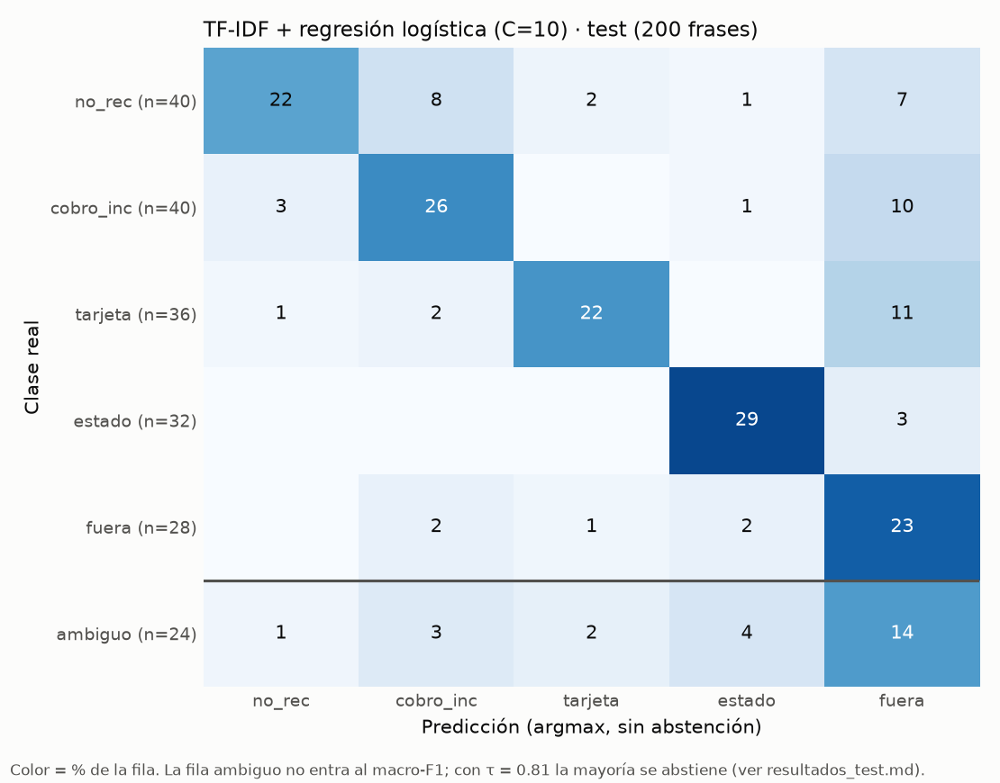

# Resultados en test · clasificador de intención (Fase 4.2, Paso 10)

Generado con `.venv/bin/python -m ml.intent.evaluar_test`. El test se abrió **una sola vez**, con el modelo y τ ya fijados en val (`criterio_seleccion.md` §5). Nada se cambió después de verlo.

- **Test:** 200 frases escritas por el equipo (`test_equipo`), 24 `ambiguo` · es 100 · pt 80 · mix 20. Otra fuente que train/val (Banking77 traducido + suplemento): es el sesgo que anticipa `data_report.md`.
- **Cada candidato** usa la variante que ganó su familia en val y **su propio τ de val**. Embeddings se reporta también en su mejor variante de 6 clases.
- **Ganador (elegido en val):** TF-IDF + regresión logística (C=10), τ_intención = 0.81. ★ en la tabla.
- Macro-F1 y F1 por idioma/clase: sin `ambiguo` y sin abstención. Cobertura y precisión: todas las frases, con τ; contestar un `ambiguo` es error.

## Tabla final

| Candidato | Variante | macro-F1 val | **macro-F1 test** | F1 es | F1 pt | F1 mix | τ (de val) | Cobertura | Precisión | ambiguo abstenidas | Latencia p50 (ms) | Costo por 1.000 (USD) |
| :-- | :-- | --: | --: | --: | --: | --: | --: | --: | --: | --: | --: | --: |
| Baseline 0 · clase mayoritaria | – | 0,099 | **0,055** | 0,062 | 0,057 | 0,000 | 0,00 | 100,0% | 14,0% | 0,0% | 0,0 | 0,00 |
| Baseline 1 · palabras clave | – | 0,646 | **0,538** | 0,598 | 0,423 | 0,518 | 0,00 | 100,0% | 45,0% | 0,0% | 0,0 | 0,00 |
| TF-IDF + regresión logística ★ | C=10 | 0,908 | **0,702** | 0,698 | 0,673 | 0,693 | 0,81 | 35,5% | 84,5% | 79,2% | 0,6 | 0,00 |
| Embeddings + regresión logística | modelo=e5s, C=10, clases=5 | 0,857 | **0,706** | 0,662 | 0,713 | 0,689 | 0,66 | 47,5% | 82,1% | 58,3% | 14,2 | 0,00 |
| Embeddings + regresión logística | modelo=e5s, C=10, clases=6 | 0,856 | **0,699** | 0,662 | 0,693 | 0,689 | 0,61 | 47,0% | 87,2% | 79,2% | 14,2 | 0,00 |
| Gemini zero-shot | gemini-3.8-flash, intent_zeroshot_v1 | 0,904 | **1,000** | 1,000 | 1,000 | 0,800 | 0,96 | 64,0% | 99,2% | 95,8% | 1.685 | 1,51 |

Latencia: mediana por frase; los locales en laptop sin red, Gemini solo el tiempo de la API. Costo de Gemini con precio de capa pagada (ver `comparacion_candidatos.md`).

## F1 por clase en test

| Candidato | Variante | no_rec | cobro_inc | tarjeta | estado | fuera |
| :-- | :-- | --: | --: | --: | --: | --: |
| Baseline 0 · clase mayoritaria | – | 0,000 | 0,000 | 0,000 | 0,000 | 0,275 |
| Baseline 1 · palabras clave | – | 0,407 | 0,545 | 0,468 | 0,862 | 0,406 |
| TF-IDF + regresión logística | C=10 | 0,667 | 0,667 | 0,721 | 0,892 | 0,561 |
| Embeddings + regresión logística | modelo=e5s, C=10, clases=5 | 0,627 | 0,718 | 0,746 | 0,853 | 0,585 |
| Embeddings + regresión logística | modelo=e5s, C=10, clases=6 | 0,627 | 0,709 | 0,735 | 0,853 | 0,571 |
| Gemini zero-shot | gemini-3.8-flash, intent_zeroshot_v1 | 1,000 | 1,000 | 1,000 | 1,000 | 1,000 |

## Ganador: val vs. test

| | macro-F1 | F1 es | F1 pt | F1 mix | Cobertura | Precisión | ambiguo abstenidas |
| :-- | --: | --: | --: | --: | --: | --: | --: |
| val | 0,908 | 0,929 | 0,878 | 0,919 | 63,3% | 95,3% | 80,0% |
| test | 0,702 | 0,698 | 0,673 | 0,693 | 35,5% | 84,5% | 79,2% |

Con τ = 0.81 en test contesta 71 de 200 frases; de las 24 `ambiguo` contesta 5.

## Errores del ganador en test

### Frases con intención mal clasificadas (54, de las cuales 6 se contestarían con τ = 0.81)

Primero las que el bot contestaría mal (confianza ≥ τ); el resto terminaría en una pregunta de aclaración.

| id | idioma | frase | real | predicho | confianza | ¿contesta con τ? |
| :-- | :-- | :-- | :-- | :-- | --: | :-- |
| t010-01 | mix | me cobraron 1 real e n sei xq, parece uma cobranca de teste | no_rec | cobro_inc | 0,97 | **sí (error visible)** |
| t017-04 | pt | de onde tiraram essa gorjeta na minha conta do almoco? eu n autorizei | cobro_inc | no_rec | 0,91 | **sí (error visible)** |
| t004-02 | es | me sale un pedido de 649 pesos en mercado libre, yo no pedi nada. la tarjeta la traigo en la cartera | no_rec | tarjeta | 0,89 | **sí (error visible)** |
| t027-04 | pt | esqueci o cartao no caixa da farmacia, o q eu faco enquanto isso? | tarjeta | fuera | 0,88 | **sí (error visible)** |
| t025-02 | pt | levaram meu celular desbloqueado, dali eles conseguem entrar no cartao virtual do banco | tarjeta | fuera | 0,88 | **sí (error visible)** |
| t044-04 | pt | continuo esperando o reembolso q a loja me prometeu, n tenho nenhuma reclamacao aberta com vcs | fuera | estado | 0,86 | **sí (error visible)** |
| t035-03 | pt | ja vi q o banco recusou meu caso vcs podem explicar no q se basearam pra decidir isso? | estado | fuera | 0,79 | no (pide aclaración) |
| t022-04 | es | se me extravio la del banco, no puedo ubicar donde fue. q hago? | tarjeta | fuera | 0,78 | no (pide aclaración) |
| t019-03 | pt | n fiz nenhum pagamento manual o debito automatico cobrou o mesmo boleto de luz duas vezes, ta me faltando essa grana | cobro_inc | no_rec | 0,76 | no (pide aclaración) |
| t015-04 | es | oigan cumpli lo q pedian para no pagar la cuota y aun asi me la descontaron, necesito q arreglen eso | cobro_inc | fuera | 0,76 | no (pide aclaración) |
| t008-03 | pt | tava dormindo qdo o celular tocou era um aviso de cobranca, abri agora e n sei do q eh | no_rec | fuera | 0,74 | no (pide aclaración) |
| t037-03 | mix | termine de abrir el caso no banco pra me organizar queria saber cual es el prazo de resolucion desde agora | estado | fuera | 0,72 | no (pide aclaración) |
| t025-04 | pt | meu cartao virtual ficou aberto no celular q roubaram, o q eu faco agora? | tarjeta | fuera | 0,71 | no (pide aclaración) |
| t014-01 | es | compre a meses sin intereses y si me metieron intereses | cobro_inc | fuera | 0,71 | no (pide aclaración) |
| t005-03 | es | me explican a q corresponde el cobro del lunes por 175 pesos? | no_rec | cobro_inc | 0,68 | no (pide aclaración) |
| t017-01 | pt | colocaram gorjeta sem eu aceitar | cobro_inc | fuera | 0,67 | no (pide aclaración) |
| t025-01 | pt | roubaram meu celular e tava com o app do nubank aberto com meu cartao virtual | tarjeta | fuera | 0,66 | no (pide aclaración) |
| t020-03 | mix | parei pra encher el tanque y pague con cartao ya aparecen tres pagos por essa misma gasolina, no botei tres veces | cobro_inc | fuera | 0,65 | no (pide aclaración) |
| t015-02 | es | esa comision no la tenia q pagar, me ofrecieron la tarjeta sin ese cobro | cobro_inc | fuera | 0,65 | no (pide aclaración) |
| t007-01 | pt | todo mes aparece a mesma cobranca e n sei do q eh | no_rec | cobro_inc | 0,64 | no (pide aclaración) |
| t019-02 | pt | tenho a agua no debito automatico e descontaram duas vezes os 73 reais desse mes | cobro_inc | no_rec | 0,63 | no (pide aclaración) |
| t017-02 | pt | eu paguei a comida, mas esses 18 reais de taxa de servico colocaram sem me perguntar | cobro_inc | fuera | 0,60 | no (pide aclaración) |
| t013-02 | es | che cancele la suscripcion el mes pasado, xq me sacan guita de nuevo por eso? | cobro_inc | fuera | 0,59 | no (pide aclaración) |
| t002-01 | es | me sale un cobro en dolares y yo no he comprado nada afuera | no_rec | cobro_inc | 0,59 | no (pide aclaración) |
| t014-03 | es | cuando pague me confirmaron la promo sin intereses ahora el estado de cuenta trae intereses por esa compra, necesito q lo corrijan | cobro_inc | fuera | 0,59 | no (pide aclaración) |
| t027-01 | pt | deixei meu cartao no restaurante na hora de pagar e fui embora | tarjeta | fuera | 0,57 | no (pide aclaración) |
| t005-02 | es | el 18 me descontaron 920, de q es eso? | no_rec | cobro_inc | 0,55 | no (pide aclaración) |
| t023-03 | es | ayer use un cajero y la ranura se movia raro despues me quede pensando q pudieron clonarme la tarjeta ahi, necesito reportarlo | tarjeta | fuera | 0,55 | no (pide aclaración) |
| t013-03 | es | ya habia terminado la membresia y tengo la baja confirmada ahora abro el resumen y otra vez la cuota del gimnasio, no corresponde | cobro_inc | estado | 0,52 | no (pide aclaración) |
| t024-01 | es | van 4 compras q no hice en menos de una hora!! | tarjeta | no_rec | 0,51 | no (pide aclaración) |
| t043-01 | pt | recusaram meu cartao na loja | fuera | tarjeta | 0,51 | no (pide aclaración) |
| t003-01 | es | che tengo una compra del domingo y ese dia ni use la tarjeta | no_rec | fuera | 0,50 | no (pide aclaración) |
| t001-04 | es | oye ese comercio q sale abreviado en el resumen no me suena de nada. me dicen de q es el cargo? | no_rec | cobro_inc | 0,48 | no (pide aclaración) |
| t022-02 | es | che no encuentro el plastico, ya revise por todos lados y ni se en q momento lo perdi | tarjeta | fuera | 0,47 | no (pide aclaración) |
| t023-02 | es | esa terminal donde pague tenia una pieza suelta, me preocupa q hayan copiado mi tarjeta | tarjeta | fuera | 0,46 | no (pide aclaración) |
| t030-03 | es | hola, ya tengo un caso levantado en el banco mi numero es 735810, queria saber si ha avanzado | estado | fuera | 0,46 | no (pide aclaración) |
| t043-02 | pt | tinha q pagar 64 reais na farmacia e a maquininha deu pagamento negado, o q eu faco? | fuera | cobro_inc | 0,46 | no (pide aclaración) |
| t024-04 | es | en dos horas me gastaron lana en varios comercios, no autorice ni una compra. ayudenme ya | tarjeta | cobro_inc | 0,44 | no (pide aclaración) |
| t012-03 | es | si compre en esa tienda, tengo el recibo aca la suma que pague en caja es menor a la que me cargaron en la tarjeta, me revisan eso? | cobro_inc | fuera | 0,43 | no (pide aclaración) |
| t024-02 | es | me estan llegando cobros uno tras otro desde hace media hora, ninguno es mio, urge | tarjeta | fuera | 0,43 | no (pide aclaración) |
| t014-04 | es | oye la compra sigue en mensualidades pero me agregaron 180 de intereses, se suponia q no llevaba | cobro_inc | fuera | 0,43 | no (pide aclaración) |
| t001-02 | es | me quitaron 287 pesos y el nombre sale como un monton de letras, no ubico esa compra | no_rec | cobro_inc | 0,41 | no (pide aclaración) |
| t002-02 | es | 35 USD?? no he salido de colombia ni pedido cosas del exterior, esa compra no es mia | no_rec | fuera | 0,41 | no (pide aclaración) |
| t002-04 | es | oigan me descontaron plata por una compra extranjera q no hice. ni he viajado | no_rec | fuera | 0,41 | no (pide aclaración) |
| t044-01 | pt | a loja disse q ia me devolver a grana e nada, so falei com eles | fuera | cobro_inc | 0,40 | no (pide aclaración) |
| t007-03 | pt | tava comparando minhas faturas tem um desconto todo mes com a mesma descricao, n faco ideia de pra quem to pagando | no_rec | fuera | 0,39 | no (pide aclaración) |
| t044-02 | pt | devolvi uns sapatos e a loja prometeu reembolsar 130 reais, n vi nada ainda. no banco n reclamei | fuera | estado | 0,39 | no (pide aclaración) |
| t009-04 | pt | n peco delivery e tao me cobrando um pedido num desses apps. q aconteceu? | no_rec | fuera | 0,38 | no (pide aclaración) |
| t027-03 | pt | terminei de comer e sai correndo o cartao ficou no balcao do restaurante, to longe e n to com ele | tarjeta | fuera | 0,37 | no (pide aclaración) |
| t027-02 | pt | acabei de chegar em casa e lembrei q o cartao ficou na loja, n peguei de volta | tarjeta | cobro_inc | 0,36 | no (pide aclaración) |
| t004-04 | es | oye, como me cobraron una compra online si no compre y ni he soltado mi tarjeta? | no_rec | fuera | 0,36 | no (pide aclaración) |
| t007-02 | pt | de novo esses 17 reais na fatura, aparecem todo mes e continuo sem saber o q sao | no_rec | estado | 0,34 | no (pide aclaración) |
| t008-02 | pt | n entendi essa notificacao de madrugada de 86 reais, n comprei nada | no_rec | cobro_inc | 0,33 | no (pide aclaración) |
| t003-02 | es | el martes estuve en casa sin comprar nada, de donde sale este gasto de 18400 pesos? | no_rec | tarjeta | 0,28 | no (pide aclaración) |

### Frases `ambiguo` que el modelo contesta con τ = 0.81 (5 de 24)

| id | idioma | frase | predicho | confianza |
| :-- | :-- | :-- | :-- | --: |
| t050-04 | mix | como faco pra presentar mi reclamo? | estado | 0,96 |
| t050-01 | mix | quiero reclamar uma coisa | estado | 0,94 |
| t049-04 | pt | pagamento | fuera | 0,86 |
| t047-02 | es | la verdad una verguenza como atienden ustedes | fuera | 0,83 |
| t049-02 | pt | cobranca | cobro_inc | 0,83 |

## Runs

- Baseline 0 · clase mayoritaria (–): val `20260929-170608_mayoritaria_val.json` · test `20260929-190908_mayoritaria_test.json`
- Baseline 1 · palabras clave (–): val `20260929-170609_reglas_val.json` · test `20260929-190908_reglas_test.json`
- TF-IDF + regresión logística (C=10): val `20260929-170918_tfidf_lr_val.json` · test `20260929-190909_tfidf_lr_test.json`
- Embeddings + regresión logística (modelo=e5s, C=10, clases=5): val `20260929-173005_embeddings_lr_val.json` · test `20260929-190914_embeddings_lr_test.json`
- Embeddings + regresión logística (modelo=e5s, C=10, clases=6): val `20260929-173122_embeddings_lr_val.json` · test `20260929-190917_embeddings_lr_test.json`
- Gemini zero-shot (gemini-3.8-flash, intent_zeroshot_v1): val `20260929-183041_gemini_zeroshot_val.json` · test `20260929-192926_gemini_zeroshot_test.json`
