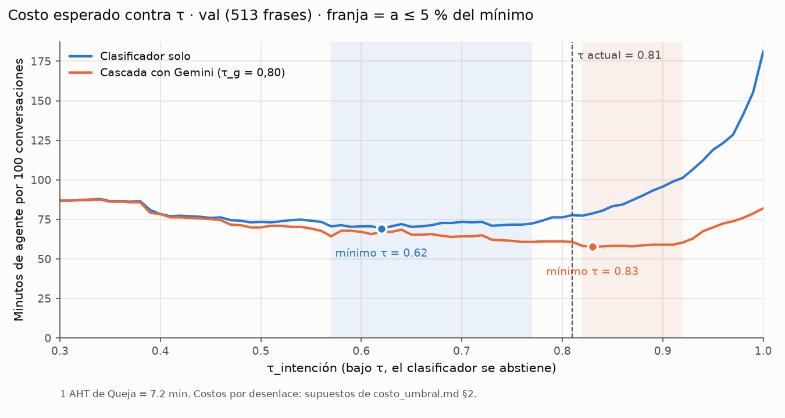
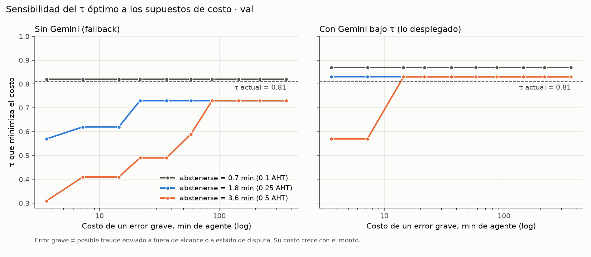

# τ_intención por costo esperado

**Dueño:** B · **Fecha:** 2-oct-2026 · **Script:** `ml/thresholds/costo_umbral.py` · **No cambia τ**: es un análisis sobre la decisión D4.3.

## 1. Pregunta

D4.3 eligió τ = 0,81 como "el umbral de mayor cobertura con precisión ≥ 95 % en val". Ese criterio no dice cuánto cuesta abstenerse ni cuánto cuesta equivocarse. Aquí se le pone un costo de negocio a cada desenlace y se busca el τ que minimiza el costo esperado, en las dos configuraciones del NLU: el clasificador solo (fallback sin Gemini) y la cascada con Gemini bajo τ (D4.5, lo desplegado).

## 2. Modelo de costos

Unidad: **minutos de agente**. Ancla medida: el AHT de los contactos de `Queja` del call center, 434,6 s ≈ **7,2 min** (`analysis/metricas_problema.json`). Los factores son **supuestos**; por eso la §4 los varía.

| Desenlace del NLU | Factor (× AHT) | Minutos | Por qué |
| :-- | --: | --: | :-- |
| Acierto | 0 | 0 | – |
| Pide aclaración (confianza < τ) | 0,25 | 1,8 | Un turno más. Con `max_clarifications` = 2, una parte llega a agente. |
| Error leve (confusión entre disputas, o algo no-disputa tomado como disputa) | 0,5 | 3,6 | El flujo equivocado se nota en la confirmación explícita: el cliente cancela y reexplica. |
| `ambiguo` contestado | 0,5 | 3,6 | El bot adivina sobre una frase sin intención; mismo efecto que un error leve. |
| Rechazo (una disputa real a `fuera_de_alcance`) | 1 | 7,2 | El cliente recibe "no puedo con eso" y vuelve a llamar. |
| **Grave** (`cargo_no_reconocido` o `tarjeta_comprometida` a `fuera_de_alcance` o `estado_disputa`) | 2 | 14,5 | Posible fraude no atendido: vuelve a llamar y la tarjeta sigue expuesta. Crece con el monto. |

Lo que este modelo **no** cuenta: el costo por llamada de Gemini (~USD 0,0015 por frase, despreciable frente a un minuto de agente) y la latencia. La intención no ejecuta acciones: la política y la confirmación siguen después (D1.1), así que ningún desenlace del NLU por sí solo mueve dinero.

## 3. Resultado (val, 513 frases, predicciones ya guardadas)

| Configuración | τ de costo mínimo | Franja a ≤ 5 % del mínimo | Costo en τ* | Costo en τ = 0,81 | Cobertura en 0,81 → en τ* |
| :-- | --: | :-- | --: | --: | :-- |
| **Cascada con Gemini** (lo desplegado) | **0,83** | 0,82–0,92 | 58 min / 100 | 61 min / 100 | 93,0 % → 92,8 % |
| Clasificador solo (sin llave de Gemini) | 0,62 | 0,57–0,77 | 69 min / 100 | 78 min / 100 | 64,1 % → 82,5 % |

Desenlaces en τ = 0,81 (val): con cascada, 430 aciertos, 36 aclaraciones, 17 leves, 15 `ambiguo` contestados, 12 rechazos y 3 graves; con el clasificador solo, 313 aciertos, 184 aclaraciones, 5 leves, 9 `ambiguo` contestados, 2 rechazos y 0 graves.

**Lectura:**

- **En lo desplegado, 0,81 queda a 5 % del mínimo** (61 contra 58 min por 100 conversaciones). El criterio de precisión de D4.3 y el criterio de costo dan casi lo mismo.
- **Sin Gemini, 0,81 es demasiado conservador** bajo estos supuestos: abstenerse en el 36 % de las frases cuesta más que los errores que evita. El óptimo sería ~0,62 (13 % menos costo), a cambio de 2 errores graves en val en vez de 0.
- La diferencia tiene sentido: en la cascada, subir τ no cuesta una aclaración sino una consulta a Gemini, que casi siempre acierta. Por eso ahí conviene un τ alto, y sin Gemini conviene uno más bajo.

## 4. Sensibilidad y τ por monto

Se barre el costo del error grave (0,5 a 50 AHT, es decir, de 4 a 360 min) para tres costos de abstención (0,1, 0,25 y 0,5 AHT).

- **Cascada:** τ* = 0,83 en casi todo el rango (0,87 si abstenerse es muy barato; 0,57 solo si abstenerse es caro *y* el error grave barato). **La conclusión no depende de los supuestos.**
- **Clasificador solo:** τ* sube con el costo del error grave (0,57 → 0,73) y baja si abstenerse es caro. Solo llega a 0,81 si abstenerse cuesta ≤ 0,1 AHT.
- **¿Un τ que dependa del monto?** El costo del error grave crece con el monto, así que la idea es natural. Pero en la cascada el τ óptimo **no se mueve** con el costo del error grave: los 3 errores graves restantes vienen de Gemini, no del umbral del clasificador. Subir τ en disputas grandes no los evita. La protección por monto ya está donde corresponde, en la política (`amount_usd_max` por tipo de transacción, escalación por encima del p95). Sin Gemini sí ayudaría (0,62 en montos bajos y 0,73 en altos), pero el set de val no trae montos y en val solo hay 2 errores graves, así que no hay datos para calibrarlo.

## 5. Decisión

- **No se cambia τ.** En la configuración desplegada, el τ por precisión ya está en la franja de costo mínimo, y las corridas finales de la Fase 6 se hicieron con 0,81.
- Para el **modo sin Gemini** (fallback), un τ más bajo (~0,6–0,7) bajaría el costo. Queda como mejora documentada, no aplicada: cambiaría el sistema después de la evaluación final y habría que medirlo aparte.

## 6. Limitaciones

- Los factores de costo son supuestos. La §4 muestra que la conclusión para la cascada no depende de ellos, pero la del clasificador solo sí.
- Val sale de la misma distribución que train (D4.2). En test, el clasificador solo contesta menos (37,5 %), así que sin Gemini el argumento para bajar τ sería aún más fuerte.
- El modelo servido se reentrenó con train+val; estas predicciones son del modelo entrenado solo con train (el mismo con el que se eligió τ).
- 6 frases de val (las del lote de D4.6) no tienen predicción de Gemini y se cuentan como aclaración en la cascada.
- Un error grave se define por la intención. No mide si después la búsqueda, la política o la confirmación lo habrían corregido.
